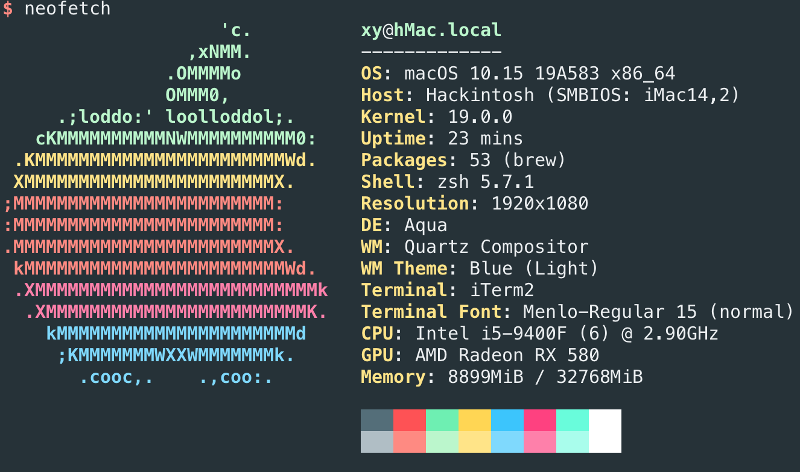
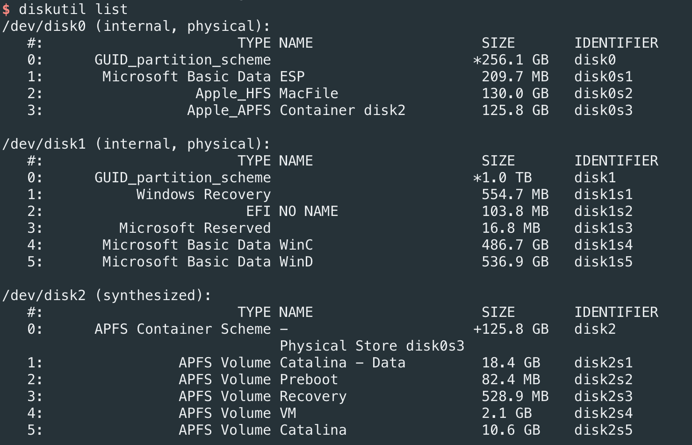

# Hackintosh catalina EFI

## 电脑配置

| 类型 | 型号 |
| ------ | ---------- |
| CPU| 英特尔i5 9400F |
| 主板| ASUS TUF B360M-PLUS GAMING S |
| 显卡 | 蓝宝石 RX590 8G D5 超白金 OC |
| 内存 | 十铨 火神系列 DDR4 2666 16GB * 2|
| 主硬盘 | 英特尔 760P 250G |
| 次硬盘 | 浦科特 M9PeG 1TB （Windows）|
| 网卡 | BCM94360CS2 |


## 不能正常工作
1. 无法使用DP连接的显示器输出声音，但是可以用耳机
2. 可以打开蓝牙，但是无法搜索或者被搜索到（Windows下也有这个问题）


## 测试没问题的

1. USB, 包括主板上的3.1，机箱上的2.0，3.0。没有测试 type-c
2. DP口,HDMI口能用
3. WiFi、以太网卡
4. 硬件加速

## 备份信息
### 截图



分区情况：
1. 系统安装在 disk0s3
2. 用户目录在 disk0s2, 在系统出问题以后可以只恢复系统所在的分区



### APFS 扩容

在更新 Catalina 的时候，为了避免出问题，所以没有直接在Mojave的分区进行更新，而是增加了一个新的分区来安装 Catalina，确认没有问题以后需要把旧的分区合并到新的分区：
```shell
sudo diskutil apfs deleteContainer disk0s4
sudo diskutil eraseVolume "Free Space" %noformat% /dev/disk0s4
sudo diskutil apfs resizeContainer disk0s3 0
# disk0s3 是要保留的新分区
```
注：这个方法需要保证新的分区在旧的分区前面，如果在后面，会合并失败。解决方法是把新的分区移动到前面。比如用Paragon Hard Disk Manager，在Windows里移动。 
